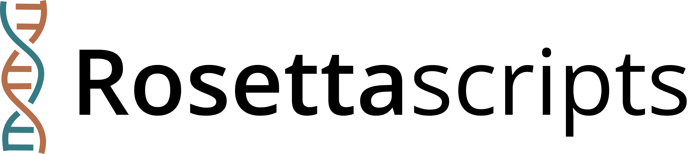

# 

[](https://doi.org/10.5281/zenodo.10963214)

Rosetta-scripts comprises a set of helper scripts for homology and *de novo* modeling with Rosetta. A tutorial to get started with Rosetta and rosettascripts is available [here]()
Currently rosettascripts contains the following Python and Unix utilities:


- **submitJobs**: running multiple Rosetta jobs in parallel using a `rna_denovo` master file
  <details>
  <summary>Usage</summary>
  
  ```
  submitJobs -i <FARFAR input script> [-d <directory>] [-p <number of processors>]
  ```
  </details>
- **extract_pdb**: extract decoys from a Rosetta silentfile and optionally concatenate them into a single multi-model PDB file
  <details>
  <summary>Usage</summary>
  
  ```
  extract_pdb -s <silentfile> -f <folder with silentfiles> -n <number of models> -e <extract pdbs (true|false, default: true)> -m <merge pdbs (true|false, default: false)>
  ```
  </details>
- **pdb_resi_renumber**: renumber the residues of a PDB file
  <details>
  <summary>Usage</summary>
  
  ```
  pdb_resi_renumber [-h] [--version] -pdb PDB [-i] -e EDIT [-o O]

  renumber residues in PDB files

  optional arguments:
    -h, --help            show this help message and exit
    --version             show program's version number and exit
    -pdb PDB              pdb input file (.pdb)
    -i                    in-place modification
    -e EDIT, --edit EDIT  'oldResi>newResi' (use "," to separate individual residues and "-" for residue ranges; e.g. '2-4,5>A:6-8,9')
    -o O                  pdb output filename
  ```
  </details>
- **process_silentfile**: remove non-standard residues from a silentfile
  <details>
  <summary>Usage</summary>
  
  ```
  process_silentfile -s <silentfile>
  ```
  </details>

## Tutorial on riboswitch de novo modeling
  We outline the steps involved in setting up a *de novo* modeling pipeline using Rosetta's FARFAR2 protocol (Watkins et al., *Structure* 2020). [Here](tutorial/Mn_riboswitch.md), we demonstrate the workflow by modeling a manganese riboswitch.
