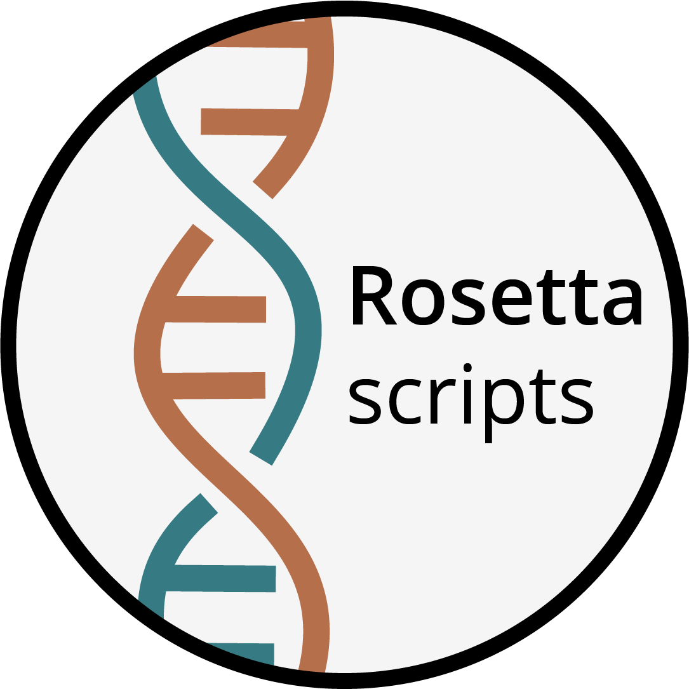

# 

Rosetta-scripts comprises a set of helper scripts for homology and *de novo* modeling with Rosetta.
Currently is contains the following Python and Unix utilities:

- **submitJobs**: running multiple Rosetta jobs in parallel using a `rna_denovo` master file
- **extract_pdb.sh**: extract decoys from a Rosetta silentfile and optionally concatenate them into a single multi-model PDB file
- **pdb_resi_renumber.py**: renumber the residues of a PDB file
- **process_silentfile.sh**: remove non-standard residues from a silentfile
