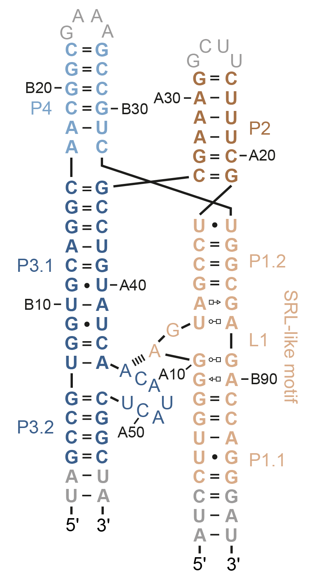

# *De novo* modeling of a Manganese riboswitch with Rosetta

## Installation
Before starting make sure you have the following packages installed:
- [Rosetta](https://www.rosettacommons.org/software/license-and-download) (from RosettaCommons)
- [rosettascripts](https://github.com/RNA-FRETools/rosettascripts.git) (from this repo)

## Preparation
The riboswitch that we are modeling here is derived from the *yybP-ykoY* aptamer of Xanthomoinas oryzae (Suddala, *Nat. Commun.*, 2019). 



The RNA sequence  and secondary structure annotation are provided as inputs for *de novo* modeling:

`mn_riboswitch.fasta`
```
>mn_riboswitch A:1-57 B:1-48
auccuuggggaguagccugcuuucuucggaaagcgccuguaucaacauacucggcua,uagccguggugcaggcaacggcgaaagccgucuggcgagaccagggau
```
`mn_riboswitch_secstruct.txt`
```
((((((((......(((.((((((....))))))((((((((((.......((((((,)))))))))))))))).(((((....)))))..)))....))))))))
```

## FARFAR Rosetta modeling
The FARAFAR2 protocol of Rosetta includes improved base-pair sampling, and an updated fragment library and socring function (Watkins et al., *Structure* 2020). Models are calculated with `rna_denovo`. To run `rna_denovo` on multiple cores in parallel rosettascripts provides a utility script `submitJobs` to kickstart the simulations. First write the call to `rna_denovo` into a file.

`FARFAR2.txt`
```
rna_denovo.linuxgccrelease 
    -nstruct 1000 
    -fasta mn_riboswitch.fasta
    -secstruct_file mn_riboswitch_secstruct.txt
    -silent mn_riboswitch.out 
    -minimize_rna true 
    -cycles 20000
```
The flags used here are: 
- `-nstruct` number of models to compute on each core
- `-fasta` path to fasta sequence file
- `-secstruct_file` path to secondary structure in dot-bracket notation
- `-silent` output silentfile where models are stored
- `-minimize_rna` whether to refinement in the output structures with the high-resolution Rosetta potential
- `-cycles` number of Monte Carlo cycles)

Then, start the simulations on as many cores as you like (here: 12) and write the models to a silentfile in the specified output directory (here: "denovo")

```
submitJobs -i FARFAR2.txt -d denovo -p 12
```

## Postprocessing
At any time during the modeling you can check the number of generated models by running `extract_pdb` in dry mode (`-e false` prevents extraction of any PDB file):

```
extract_pdb -d denovo -e false
```

You can extract the top scoring PDB models (here: n=10) from the Rosetta generated silentfiles (set the `-m` flag to true if you want to merge them into a single PDB file)

```
extract_pdb -d denovo -n 10 -m true
```
